<div align="center">


# EXPENZO

**Track Smart. Spend Smarter.**

A private, **offline-first** personal expense tracker built with React Native & Expo.<br/>
Track expenses, set budgets, manage categories, and visualize your spending — all stored **on your device**, no internet required.

<p>
  
  
  
  
</p>

</div>

---

## ✨ Features

- **Expense management** — add, edit, and delete transactions (amount, category, date, optional note)
- **Custom categories** — create and delete categories with your own color + icon (defaults are protected)
- **Monthly budgets** — set a limit and track it with a progress bar that turns green → orange → red as you approach/exceed it
- **Analytics** — spending-by-category **pie chart**, a **last-6-months bar chart**, and a **top-categories** breakdown, with a month selector
- **Home dashboard** — total spent, this-month spend, transaction count, budget status, and recent transactions
- **Editable profile** — set your wallet name; it personalizes the home greeting
- **Notifications center** — in-app notifications screen
- **Multi-currency** — `$`, `€`, `£`, and `Rs.` with app-wide formatting
- **Light & dark mode** — full theming with a remembered preference, switches instantly
- **Onboarding** — three swipeable intro slides with animated page indicators (shown once)
- **Animated splash screen** — custom SVG + animated branding intro with liquid-wave motion
- **Swipeable tabs** — swipe left/right to move between Home, Expenses, Stats, Analytics, and Settings
- **CSV export** — export your transactions and share them via the system share sheet
- **100% offline & private** — works without internet; nothing is uploaded to any server

---

## 📱 Screenshots

### 🎬 Onboarding & Splash

<table>
  <tr>
    <td align="center">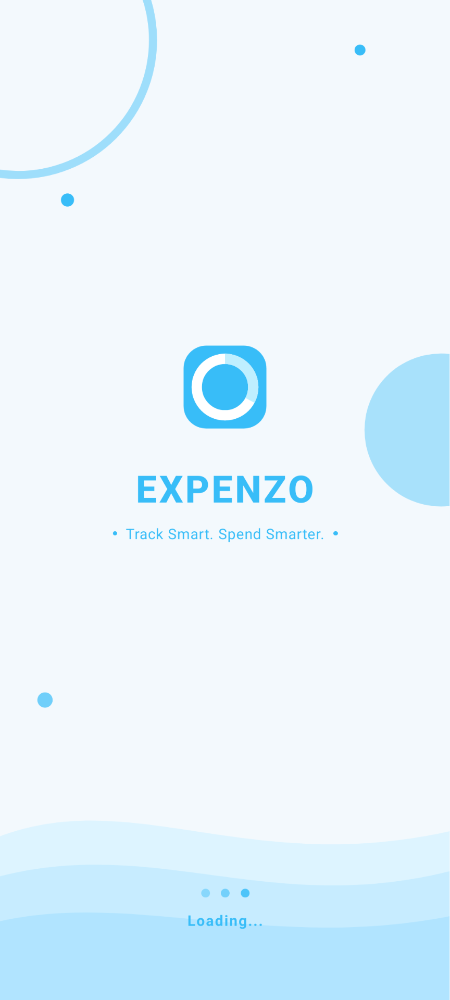<br/><sub><b>Splash</b></sub></td>
    <td align="center">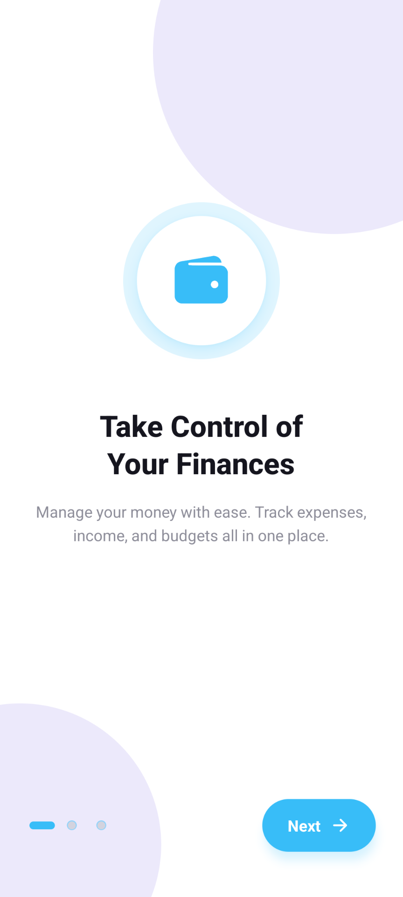<br/><sub><b>Take Control</b></sub></td>
    <td align="center">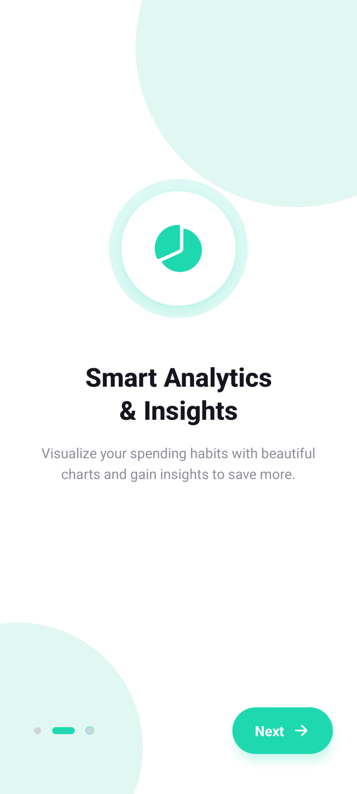<br/><sub><b>Smart Analytics</b></sub></td>
    <td align="center">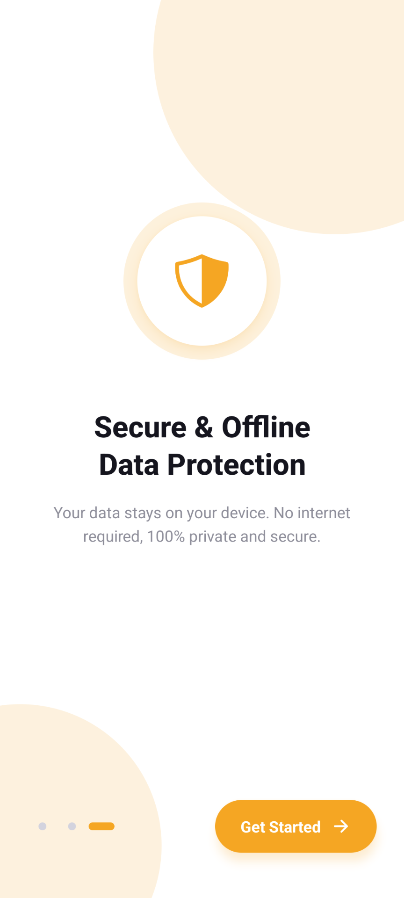<br/><sub><b>Secure & Offline</b></sub></td>
  </tr>
</table>

### 🏠 Home Dashboard

<table>
  <tr>
    <td align="center">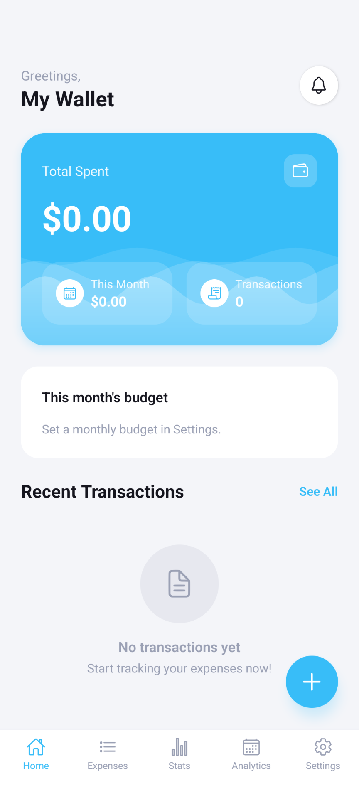<br/><sub><b>Home (Light)</b></sub></td>
    <td align="center">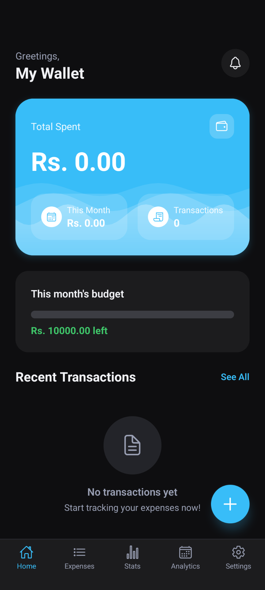<br/><sub><b>Home (Dark)</b></sub></td>
    <td align="center">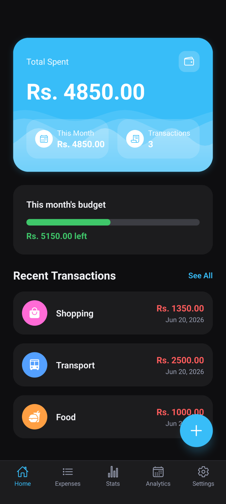<br/><sub><b>Recent Activity</b></sub></td>
    <td align="center">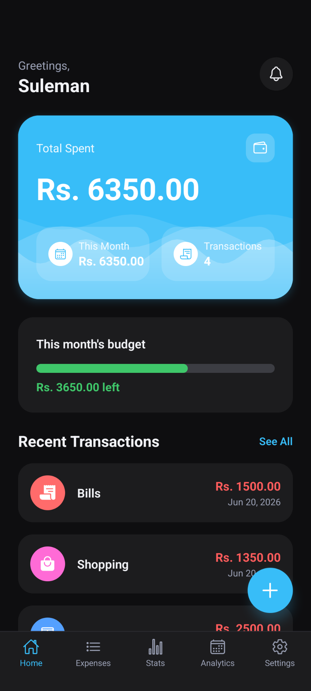<br/><sub><b>Budget Progress</b></sub></td>
  </tr>
</table>

### 📊 Stats & Analytics

<table>
  <tr>
    <td align="center">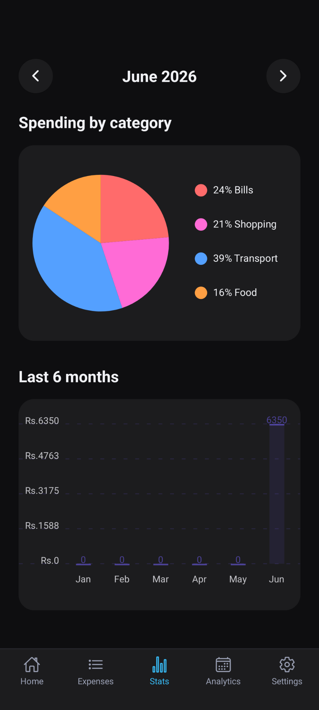<br/><sub><b>Spending Breakdown</b></sub></td>
    <td align="center">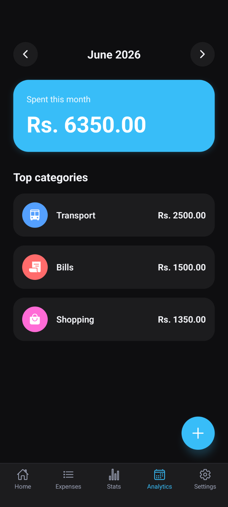<br/><sub><b>Top Categories</b></sub></td>
    <td align="center">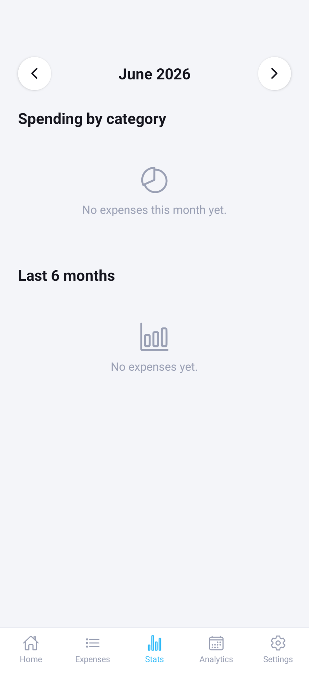<br/><sub><b>Empty State</b></sub></td>
  </tr>
</table>

### 🧾 Expenses, Categories & Notifications

<table>
  <tr>
    <td align="center">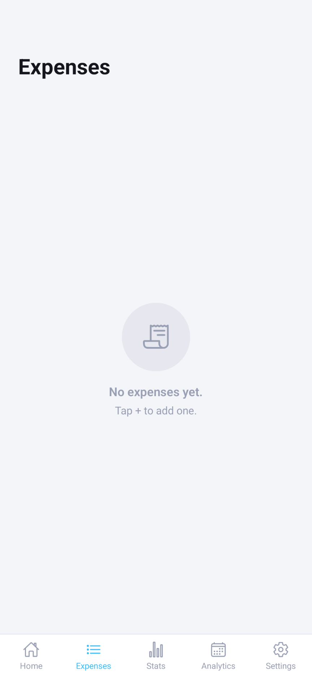<br/><sub><b>Expenses List</b></sub></td>
    <td align="center">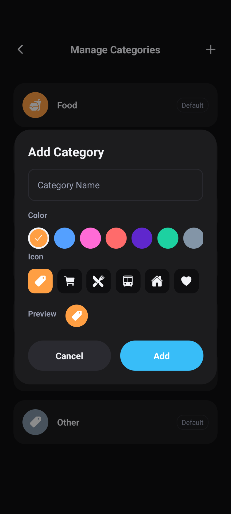<br/><sub><b>Add Category</b></sub></td>
    <td align="center">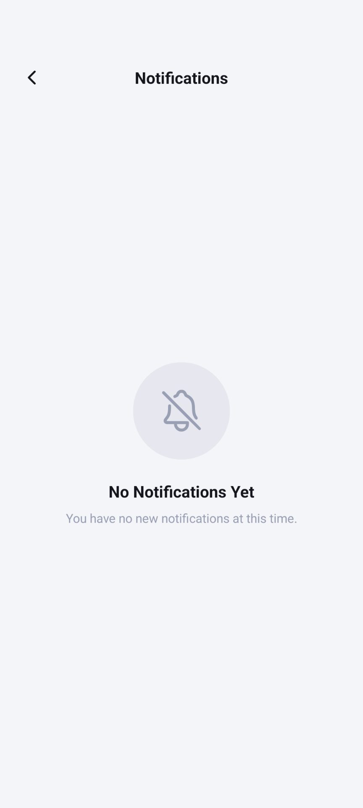<br/><sub><b>Notifications</b></sub></td>
  </tr>
</table>

### ⚙️ Settings

<table>
  <tr>
    <td align="center">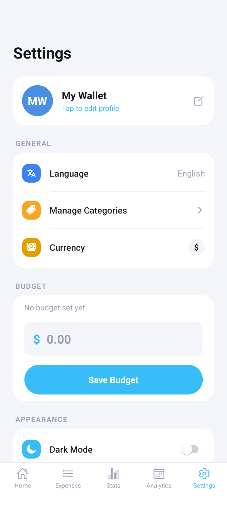<br/><sub><b>Settings (Light)</b></sub></td>
    <td align="center">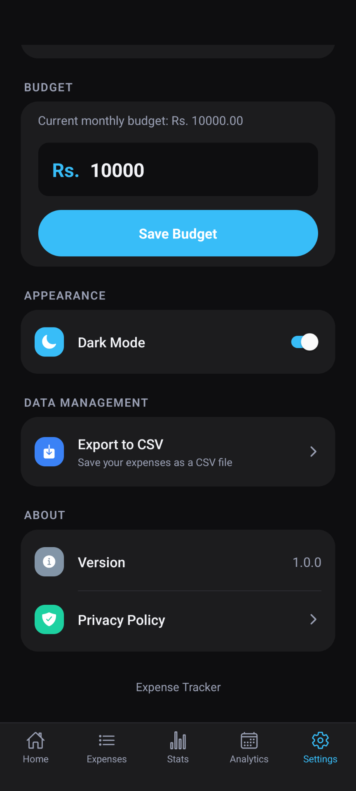<br/><sub><b>Settings (Dark)</b></sub></td>
  </tr>
</table>

---

## 🛠 Tech Stack

| Area | Tools |
|------|-------|
| Framework | React Native 0.81, Expo (SDK 54), JavaScript |
| Navigation | React Navigation (native stack + swipeable material top tabs) |
| State & storage | React Context API + AsyncStorage |
| Charts | react-native-chart-kit, react-native-svg |
| Gestures / paging | react-native-pager-view |
| Dates | date-fns, @react-native-community/datetimepicker |
| Files | expo-file-system, expo-sharing |
| Icons | @expo/vector-icons (Ionicons) |
| Build & distribution | EAS Build (Android APK) |

---

## 🚀 Getting Started (Expo Go)

```bash
# 1. Install dependencies
npm install

# 2. Start the dev server
npx expo start

# 3. Scan the QR code with the Expo Go app on your phone
```

> Requires the **Expo Go** app (Android/iOS) running on **Expo SDK 54**.

---

## 📦 Build an Android APK (EAS)

```bash
# one-time
npm install -g eas-cli
eas login

# build a shareable APK
eas build -p android --profile preview
```

When the cloud build finishes, EAS gives you a link to download the `.apk`, which you can install on any Android device (enable "Install unknown apps") and share.

---

## 🗂 Project Structure

```
ExpenseTracker/
├── App.js                 # navigation, providers, splash + onboarding wiring
├── app.json               # Expo config (name, icon, splash, android package)
├── eas.json               # EAS build profiles (preview = APK)
├── assets/                # icon, splash image, screenshots
└── src/
    ├── components/         # ExpenseListItem, ProgressBar, MonthSelector,
    │                       # AppPopup, Onboarding, AnimatedSplash, LiquidWaves
    ├── config/             # categories, currencies
    ├── context/            # ExpensesContext (single app-wide store)
    ├── screens/            # Overview, Expenses, Stats, Monthly, Settings,
    │                       # AddEditExpense, ManageCategories, Notifications,
    │                       # MonthlyExpenses
    ├── theme/              # light/dark palettes + useTheme hook
    └── utils/              # money/date formatting, CSV builder
```

---

## 🔒 Privacy

All data (expenses, budget, categories, settings) is stored **locally** on your device using AsyncStorage. EXPENZO works fully offline and does **not** send any data to a server.

---

## 📄 License

Personal project — all rights reserved. (Add a license here if you plan to open-source it.)
